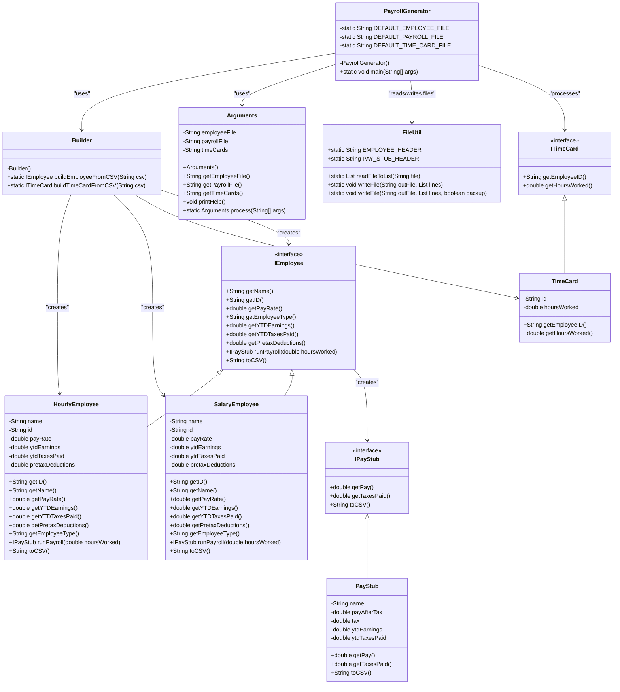
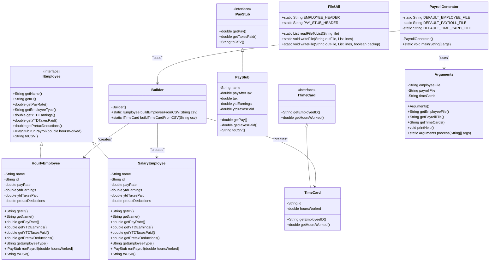

# Payroll Generator Design Document

This document is meant to provide a tool for you to demonstrate the design process. You need to work on this before you code, and after have a finished product. That way you can compare the changes, and changes in design are normal as you work through a project. It is contrary to popular belief, but we are not perfect our first attempt. We need to iterate on our designs to make them better. This document is a tool to help you do that.

## (INITIAL DESIGN): Class Diagram

## (INITIAL DESIGN): Tests to Write - Brainstorm

Write a test (in english) that you can picture for the class diagram you have created. This is the brainstorming stage in the TDD process. 

> [!TIP]
> As a reminder, this is the TDD process we are following:
> 1. Figure out a number of tests by brainstorming (this step)
> 2. Write **one** test
> 3. Write **just enough** code to make that test pass
> 4. Refactor/update  as you go along
> 5. Repeat steps 2-4 until you have all the tests passing/fully built program

You should feel free to number your brainstorm. 

1. Test that the HourlyEmployee class properly returns name from getName().
2. Test that the HourlyEmployee class properly returns id from getID().
3. Test that the HourlyEmployee class properly returns payRate from getPayRate().
4. Test that the HourlyEmployee class properly returns YTDEarnings from getYTDEarnings().
5. Test that the HourlyEmployee class properly returns YTDTaxesPaid from getYTDTaxesPaid().
6. Test that the HourlyEmployee class properly returns pretaxDeductions from getPretaxDeductions().
7. Test that the HourlyEmployee class correctly identifies as "HOURLY" from getEmployeeType().
8. Test that the SalaryEmployee class properly returns name from getName().
9. Test that the SalaryEmployee class properly returns id from getID().
10. Test that the SalaryEmployee class properly returns payRate from getPayRate().
11. Test that the SalaryEmployee class properly returns YTDEarnings from getYTDEarnings().
12. Test that the SalaryEmployee class properly returns YTDTaxesPaid from getYTDTaxesPaid().
13. Test that the SalaryEmployee class properly returns pretaxDeductions from getPretaxDeductions().
14. Test that the SalaryEmployee class correctly identifies as "SALARY" from getEmployeeType().
15. Test that HourlyEmployee.runPayroll(hoursWorked) calculates gross pay correctly for ≤40 hours.
16. Test that HourlyEmployee.runPayroll(hoursWorked) calculates gross pay correctly for >40 hours (overtime pay included).
17. Test that HourlyEmployee.runPayroll(hoursWorked) applies pretax deductions correctly.
18. Test that HourlyEmployee.runPayroll(hoursWorked) calculates correct taxes (22.65%).
19. Test that HourlyEmployee.runPayroll(hoursWorked) correctly calculates net pay.
20. Test that SalaryEmployee.runPayroll(hoursWorked) correctly calculates gross pay as (annual salary / 24 pay periods).
21. Test that SalaryEmployee.runPayroll(hoursWorked) applies pretax deductions correctly.
22. Test that SalaryEmployee.runPayroll(hoursWorked) calculates correct taxes (22.65%).
23. Test that SalaryEmployee.runPayroll(hoursWorked) correctly calculates net pay.
24. Test that runPayroll(hoursWorked) skips payroll calculation if hoursWorked < 0.
25. Test that PayStub.getPay() correctly returns net pay.
26. Test that PayStub.getTaxesPaid() correctly returns taxes paid.
27. Test that PayStub.toCSV() correctly formats the pay stub output string.
28. Test that TimeCard.getEmployeeID() correctly returns the employee ID.
29. Test that TimeCard.getHoursWorked() correctly returns the recorded hours worked.
30. Test that Builder.buildEmployeeFromCSV(csvLine) correctly creates a HourlyEmployee object from a valid CSV line.
31. Test that Builder.buildEmployeeFromCSV(csvLine) correctly creates a SalaryEmployee object from a valid CSV line.
32. Test that Builder.buildEmployeeFromCSV(csvLine) returns null if the CSV is incorrectly formatted.
33. Test that Builder.buildTimeCardFromCSV(csvLine) correctly creates a TimeCard object from a valid CSV line.
34. Test that Builder.buildTimeCardFromCSV(csvLine) returns null if the CSV is incorrectly formatted.
35. Test that PayrollGenerator correctly reads employees.csv and creates the appropriate IEmployee objects.
36. Test that PayrollGenerator correctly reads time_cards.csv and creates ITimeCard objects.
37. Test that PayrollGenerator correctly matches TimeCard data to the correct IEmployee.
38. Test that PayrollGenerator correctly calculates and stores pay stubs in pay_stubs.csv.
39. Test that PayrollGenerator correctly updates employees.csv with YTD earnings and YTD taxes paid.
40. Test that PayrollGenerator correctly handles cases where time_cards.csv has missing or invalid entries.
41. Test that FileUtil.readFileToList(filename) correctly reads a CSV file and returns a list of strings.
42. Test that FileUtil.writeFile(filename, lines) correctly writes a list of strings to a file.
43. Test that FileUtil.writeFile(filename, lines, true) correctly creates a backup before overwriting.

## (FINAL DESIGN): Class Diagram

Go through your completed code, and update your class diagram to reflect the final design. Make sure you check the file in the browser on github.com to make sure it is rendering correctly. It is normal that the two diagrams don't match! Rarely (though possible) is your initial design perfect. 

> [!WARNING]
> If you resubmit your assignment for manual grading, this is a section that often needs updating. You should double check with every resubmit to make sure it is up to date.

## (FINAL DESIGN): Reflection/Retrospective

> [!IMPORTANT]
> The value of reflective writing has been highly researched and documented within computer science, from learning new information to showing higher salaries in the workplace. For this next part, we encourage you to take time, and truly focus on your retrospective.

Take time to reflect on how your design has changed. Write in *prose* (i.e. do not bullet point your answers - it matters in how our brain processes the information). Make sure to include what were some major changes, and why you made them. What did you learn from this process? What would you do differently next time? What was the most challenging part of this process? For most students, it will be a paragraph or two. 
